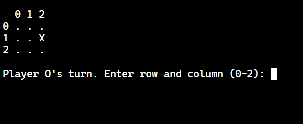

# Tic-Tac-Toe Scripting Collection



This project features implementations of the classic Tic-Tac-Toe game in a variety of scripting languages, most of which are terminal-based, containing input validation and win/draw detection. 

The entire project showcases how the same game logic can be implemented using different language paradigms and features.

## Implementations Included

| Language | File | Key Features |
|----------|------|--------------|
| JavaScript | [`TicTacToe.js`](TicTacToe.js) | Terminal-based, input validation, win/draw detection |
| Python (GUI) | [`tic_tac_toe.py`](tic_tac_toe.py) | PyGame graphical interface, mouse interaction, hover preview |
| Perl | [`TicTacToe.pl`](TicTacToe.pl) | Terminal-based, concise syntax, cross-platform |
| F# | [`TicTacToe.fsx`](TicTacToe.fsx) | Functional programming, immutable data structures |
| PHP | [`TicTacToe.php`](TicTacToe.php) | Terminal-based, web server compatible |
| Ruby | [`tictactoe.rb`](tictactoe.rb) | Clean syntax, expressive array methods |
| Lua | [`tictactoe.lua`](tictactoe.lua) | Lightweight, embeddable, pattern matching |

## Common Features

All implementations share the same core game logic:
- 3x3 game board
- Two players (X and O) taking alternate turns
- Win detection (rows, columns, diagonals)
- Draw detection when board is full
- Input validation
- Terminal clearing, or GUI display
- Player turn indicators
- Win/draw announcements

## Running the Games

### JavaScript
``` bash
node TicTacToe.js
```

### Python (GUI Version)
Requires PyGame:
```bash
pip install pygame
python tic_tac_toe.py
```

### Perl
```bash
perl TicTacToe.pl
```

### F#
Requires .NET or F# interpreter:
```bash
dotnet fsi TicTacToe.fsx
# or
fsharpi TicTacToe.fsx
```

### PHP
```bash
php TicTacToe.php
```

### Ruby
```bash
ruby tictactoe.rb
```

### Lua
```bash
lua tictactoe.lua
```

## Language Comparison Highlights

1. **Input Handling:**
   - JavaScript: `input.split(' ').map(Number)`
   - Python: `input().split()`
   - Perl: `split ' ', <STDIN>`
   - PHP: `preg_split('/\s+/', readline())`
   - Ruby: `gets.chomp.split.map(&:to_i)`
   - Lua: `string.match` with patterns

2. **Board Representation:**
   - JavaScript/PHP: 2D arrays
   - F#: Immutable nested lists
   - Python: List of lists
   - Lua: 1-based index tables

3. **Win Checking:**
   - F#: Uses `List.forall` for functional checks
   - Ruby: Leverages `all?` and `none?` methods
   - Perl: Explicit condition checks

4. **Paradigms:**
   - F#: Functional programming
   - Python/JavaScript: Multi-paradigm
   - PHP/Perl: Procedural

## Why This Project?

This collection serves as:
1. A learning resource for comparing scripting languages
2. A reference for basic game implementation patterns
3. A demonstration of different programming paradigms
4. A starting point for language-specific experiments
5. A fun way to explore language design differences

## Contributing

Contributions in additional languages are welcome! Please follow these guidelines:
1. Maintain the same core game rules
2. Include clear instructions for running the game
3. Add your implementation to the table above
4. Keep the code clean and commented
5. Ensure cross-platform compatibility where possible

## License

This project is licensed under the MIT License - see the [LICENSE](LICENSE) file for details.

## Acknowledgments

- Inspired by classic Tic-Tac-Toe
- Thanks to all communities of scripting languages
- Special thanks to PyGame for the graphical version

Enjoy exploring the different implementations!